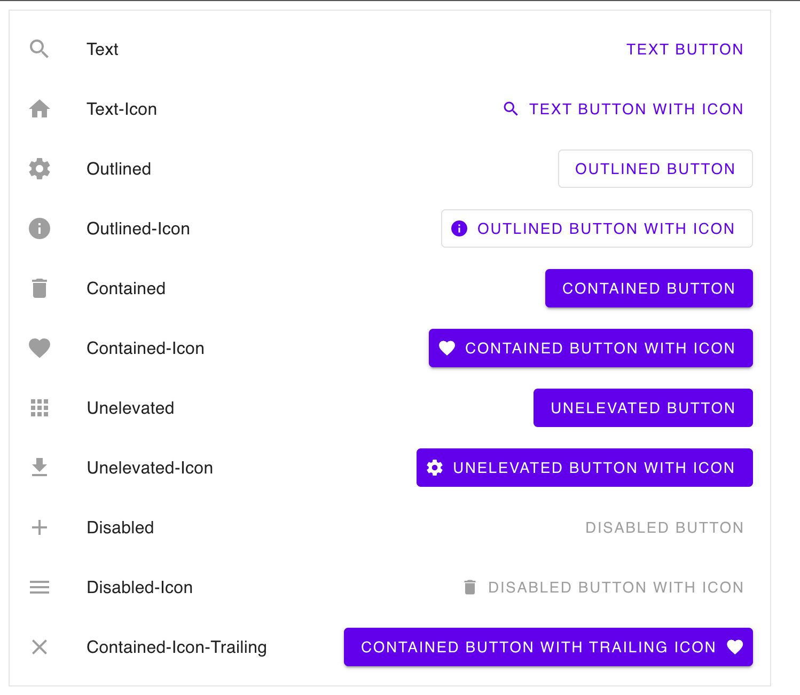

# haskell-halogen-material

Implementation of Google Material Components using [haskell-halogen-core](https://github.com/Swordlash/haskell-halogen) library.

ATM requires a fork of GHC to build (with fixed support of GHCJS_BROWSER - [PR](https://gitlab.haskell.org/ghc/ghc/-/issues/25613) is under review).

