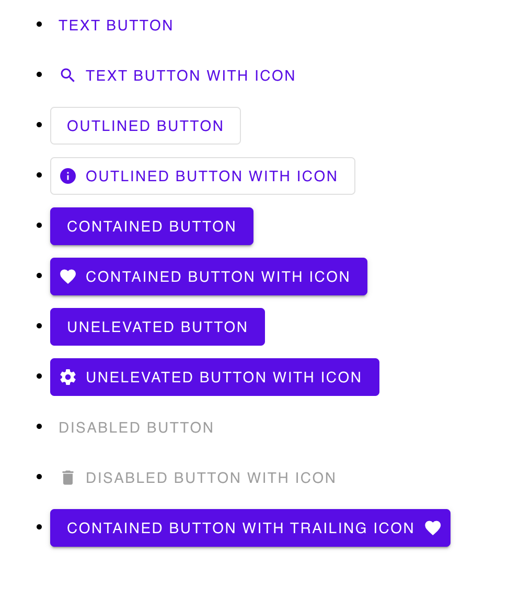

# haskell-halogen-material

[](https://github.com/Swordlash/haskell-halogen-material/actions/workflows/build.yml)

Implementation of Google Material Components using [haskell-halogen-core](https://github.com/Swordlash/haskell-halogen) library.

You can see the deployed example app [here](https://swordlash.github.io/haskell-halogen-material/).



## Building

The three targets use separate Cabal build directories:

```sh
npm run build-native # dist-newstyle/native
npm run build        # default: WebAssembly in dist-newstyle/wasm
npm run build-js     # GHC JavaScript backend, bundled into dist
```

To build and then serve a browser target:

```sh
npm run build-serve
npm run build-serve-js
```

## WebAssembly

WebAssembly is the default browser and deployment target. With the GHC wasm
toolchain installed (the version is pinned in `cabal-wasm.project`), build the
browser bundle and serve it with:

```sh
npm run build-serve
```

Then open <http://127.0.0.1:8080>. `npm run build-wasm` and
`npm run build-serve-wasm` remain explicit aliases for WASM workflows.

For browser hot reload, install
[ghciwatch](https://mercurytechnologies.github.io/ghciwatch/) and run:

```sh
npm run dev-wasm
```

This starts WASM browser GHCi on port 8080, opens its Material-enabled page,
and reruns `main` after Haskell source changes. Set `PORT` to override the
port. Native, JavaScript, production WebAssembly, and hot-reload WebAssembly
artifacts are kept in `dist-newstyle/native`, `dist-newstyle/javascript`,
`dist-newstyle/wasm`, and `dist-newstyle/wasm-dev`, respectively.
